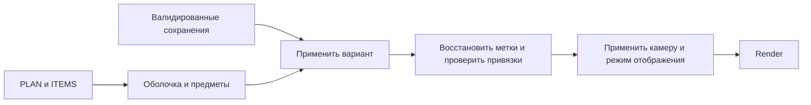

# Согласованность сцены и план развития графики

Дата: 2026-09-06. Проверяемый код: `c274bc4` (включая гардеробную 6 и последний вариант санузла 8). Автор аудита: Codex.

## 1. Рекомендация

Продолжать на **Three.js со статической публикацией**, сохранив план квартиры, постоянные ID предметов, разметку и варианты расстановки. Текущая технология позволяет получить существенно более реалистичный интерьер: правдоподобные материалы, мягкие контакты, отражения, стекло, освещение и более выразительную форму мебели. Один набор текстур поверх нынешних боксов такого результата не даст.

Порядок: **надёжное состояние и ресурсы → согласованные контракты сцены → обновление renderer и цвета → эталонная комната с PBR и светом → форма мебели → отражения и постобработка → остальные помещения**.

Целевая платформа по общему контексту проекта — MacBook пользователя. Приоритет — качество изображения и проработка квартиры; точная модель MacBook и целевой браузер ещё не зафиксированы. Не жертвовать качеством ради слабого телефона. Состояние остаётся в localStorage и экспортируемых файлах; серверная база не требуется.

Это документ аудита и будущих работ. Ниже явно разделены воспроизведённые ошибки, ограничения реализации и рекомендации. Код приложения в рамках аудита не исправлялся. Серые предметы в последних ТЗ — намеренное состояние прототипа, а не ошибка исполнения этих ТЗ.

## 2. Что проверено

Прочитаны связи между [plan.js](../plan.js), [app.js](../app.js), [items.js](../items.js), [markup.js](../markup.js), [layout.js](../layout.js), [materials.js](../materials.js), [index.html](../index.html), инструментами и документацией. Учтены [исходный план задач](../tasks/EXECUTION.md), последующие задачи помещений и [модель геометрии](GEOMETRY.md).

В ходе работы `main` изменялся другими сессиями. Первые измерения относились к `b8a278f`; итоговый снимок обновлён до `c274bc4`, повторно запущены проверки. Номера строк из старого ревью не следует применять к новым коммитам без поиска функции.

После измерений просмотрен diff `daf0153`: режим переименован в «Экскурсия», добавлена галочка скрытия человечка, сокращены названия слоёв. Это закрывает замечание о названии и даёт скрыть аватар; положение камеры за плечом и перечисленные ниже A01–A06 не меняются. Численные результаты относятся к `c274bc4`.

- `python3 tools/plan.py check` и `selftest` прошли; отрицательные случаи ожидаемо отказывают без записи.
- Браузер: установленный Chromium revision 1228 через Playwright, macOS, отдельный временный профиль, viewport 1400×1000. Рабочий путь указан в разделе 10.
- Штатный `tools/check.js` дополнен отдельными сценариями reload/импорта, переключения режимов и повторного выделения метки.
- Просмотрены сцены кухни, спальни и ванной, план и изображения из smoke-теста. Визуально заметны крупное зерно обоев, одинаковая реакция разных предметов на свет, плоские зеркала и угловатые силуэты.
- Проверка не является повторной сверкой квартиры с исходным БТИ. Также не проведены приёмка в Safari, тест на конкретной модели MacBook и длительный GPU benchmark.

Установлен **Three.js r128**: версия прочитана из vendored-файла и проверена через `THREE.REVISION`. В сцене только `HemisphereLight` и `DirectionalLight`, `scene.environment` не задано. Инвентаризация и результаты дополнительных сценариев приведены в разделе 10.

## 3. Согласованность компонентов

| Компонент | Что уже правильно | Что мешает дальнейшему развитию |
|---|---|---|
| PLAN и plan.py | Метры, стабильный origin, высоты от чистового пола, атомарная запись remap, проверки площадей | Полигон, полосы стен, cells, проёмы и отделка требуют синхронизации; допуски не доказывают полное совпадение; нет устойчивого ID поверхности стены |
| ITEMS и ITEM_GROUPS | Постоянные ID, локальные детали, отдельные группы, общие материалы | Исходные данные, runtime-позы и сохранённые poses — три представления; материал выбирается внутри build-функций, а не по назначению поверхности |
| PHYS и прогулка | Мебель действительно препятствует движению; пустота под кроватью учитывается | Каждый render mesh превращается в отдельный AABB; декор и новая детализация меняют физику; камера тесных комнат ограничена видом за плечом |
| Разметка | Координаты и текст для агента, инструменты, сохранение и привязки | Ошибка восстановления ID, небезопасный HTML, привязки к габаритам вместо реальных рёбер/поверхностей |
| Расстановка | Автоматическая копия «Исходной», отмена, варианты, предупреждения | Версия плана при импорте игнорируется; повреждённый localStorage перезаписывается; зависимые метки не обновляются общей операцией |
| VIZ и отделка | PBR-двойники, ACES, тени, исправленная синхронизация прозрачности | Состояние зависит от того, какая кнопка вызвала переход; потолок, окна и часть сцены вне общего material pipeline |
| UI и bootstrap | Нативные поля и кнопки, без лишних зависимостей | Порядок глобальных script-тегов задаёт зависимости; у режимов несколько обработчиков; размеры панелей и камеры согласованы вручную |
| Проверки и документация | Есть рабочие geometry/browser checks и сценарии комнат | Проверки в основном вызывают внутренние API, не все пользовательские цепочки; случайные текстуры; устаревшие описания и незакреплённый Playwright |

Полезную структуру сохранить. Нет основания вводить React, ECS, сложную систему событий, сервер или полностью переписывать приложение. Нужны небольшие общие операции для смены режима, применения позы, привязок и владения ресурсами.

## 4. Подтверждённые ошибки — исправить до графического расширения

### A01 · P1 · Восстановление разметки ломает уникальность ID

**Место:** `markup.js`, `restore()`.

После `MK.marks=...` добавлен комментарий на той же строке. В него попали `MK.next=...`, очистка `MK.hist` и сброс `MK.sel`: эти операции больше не выполняются.

**Воспроизведение:** создать M1 → reload → создать ещё точку. `MK.next` равен 1, новая точка тоже M1; собственный `MK.validate(MK.dump())` возвращает повтор ID. При импорте также остаются старые ссылки выделения и истории.

**Исправить:** восстановить отдельные исполняемые операции, считать next не меньше максимального сохранённого ID + 1, сбрасывать историю и выделение. Проверка: reload → новая метка → экспорт → импорт → ещё один reload, ID остаются уникальны.

### A02 · P1 · Импортированная привязка выполняется как HTML

**Место:** `markup.js`, `validate()`, `renderCard()`; необработанный `m.bind.item` включается в строку для `card.innerHTML`.

В отдельном профиле принят файл, у которого ID предмета содержал тег изображения с обработчиком ошибки. Выбор метки выполнил безвредное присваивание тестового флага. Сеть и пользовательские данные в проверке не использовались. Это подтверждённая возможность выполнения кода в контексте страницы при импорте недоверенного файла, а не просто неправильное форматирование.

**Исправить:** пользовательские названия/ID вставлять через `textContent` и `.value`; проверить все аналогичные места, включая имена вариантов. Не запрещать отсутствующий предмет целиком — его ID нужен для сообщения о потерянной привязке, но должен оставаться текстом. Проверка: HTML-подобная строка показывается буквально и ничего не выполняет. Это соответствует рекомендациям [MDN по innerHTML](https://developer.mozilla.org/en-US/docs/Web/API/Element/innerHTML).

### A03 · P2 · Режим отображения зависит от пути перехода

**Место:** `materials.js`, обработчики `vTop/vFP`; `markup.js` и `layout.js`, `toggle()`; `app.js`, `setView()`.

**Воспроизведение:** прогулка → включить визуализацию → нажать «Разметка». Получено `controls.plan=true`, `MK.on=true`, но `VIZ.active=true`, тени включены, стена всё ещё `MeshStandardMaterial`. Прямой `setView('top')` не запускает обработчик кнопки `vTop`. Аналогичный путь есть у расстановки.

**Исправить:** единая операция перехода применяет камеру, инструменты, видимость, UI и фактический render mode. Запоминать предпочтение VIZ отдельно от активного режима. Проверить все переходы кнопками и программно; будущие passes тоже должны получать новую камеру здесь.

### A04 · P1 · Повреждённое сохранение расстановки молча стирается

**Место:** `layout.js`, `loadLocal()` → `applyVariant(0)` → `persist()`.

**Воспроизведение:** в отдельном профиле положить повреждённую JSON-строку в `pulse3d.layout` → reload. Строка заменяется валидным пустым документом с `variants:[]`; предупреждения нет. При несовместимой схеме или исчезнувшем ID предмета fallback устроен аналогично.

**Исправить:** отделить чтение от записи; при ошибке сохранить исходную строку, показать проблему и дать её экспортировать. Не записывать fallback автоматически. Валидация должна происходить до применения; загрузка не должна быть мутацией хранилища.

### A05 · P2 · Вариант другого плана применяется без конфликта

**Место:** `layout.js`, `dump()/validate()/restore()`.

**Воспроизведение:** документ с `format:1`, `plan:999`, известным ID sofa и корректной позой принят; диван переместился, UI сообщил об успешном импорте.

**Исправить:** отдельно проверять версию формата и совместимость геометрии/каталога. `PLAN.meta.version=2` не идентифицирует все изменения окон, проёмов и предметов после T03. Нужна явная revision геометрии/каталога либо стабильный fingerprint, а для несовпадения — конфликт с сохранением исходного документа. Не применять чужие координаты молча.

### A06 · P2 · Повторный выбор метки накапливает GPU-ресурсы

**Место:** `markup.js`, `redraw()/label()`; сходный жизненный цикл у `layout.js`, `highlight()` и `items.js`, `rebuildPhys()`.

**Измерение:** 60 вызовов выбора одной и той же метки с кадром между ними увеличили `renderer.info.memory.geometries` на 60 и `textures` на 60. `remove()` убирает объект из сцены, но не освобождает его GPU-ресурсы. Рост подтверждён именно для разметки; остальные места требуют отдельной проверки владения, а не механического dispose всего дерева.

**Исправить:** переиспользовать геометрию маркера и текстуру подписи, обновлять существующее выделение; освобождать уникальные geometry/material/texture при замене. Общие материалы и карты не уничтожать, пока они используются. Проверка: после прогрева 100 циклов выделения/правки/переключения дают плато ресурсов. [Three.js: cleanup](https://threejs.org/manual/en/cleanup.html).

Предыдущие восемь findings от 2026-09-05 получили исправления и regression-проверки в `1f4ad40`. Здесь они не перечислены заново как открытые. A01 — новая ошибка в последующей реализации восстановления; A03 — другой путь переключения, которого не было в прежней проверке.

## 5. Архитектурные ограничения и лучшие практики

### B01 · Один смысл геометрии для всех потребителей

`wallSpec()/wallToPoint()` используют min/max комнаты, а не конкретное ребро: для ниши это может быть не существующая в выбранном месте стена. `rooms()` проверяет только углы прямоугольника или концы отрезка; в вогнутой комнате середина может пересечь стену. Привязка мебели в MK работает по AABB, тогда как LAY уже использует боксы деталей. Это разные определения одного «занятого места».

Минимальное развитие: общие функции границы/ребра комнаты и предметного контура; для настенной метки хранить `roomId + edgeId + distance + height`, а не выводить комнату каждый раз из точки на границе. Обнаружение пересечений проверяет рёбра, не только вершины. Не строить полный CAD kernel: сначала покрыть существующие ниши, окна и двери.

Отделка и предметы имеют независимые координаты отступов. История санузла 9 уже показала зеркало за плиткой. Источником плоскости крепления должна быть **готовая поверхность** стены с отделкой, а не приблизительная грань комнаты; здесь же задать ориентацию и толщину. Описанный в GEOMETRY.md двойной сдвиг двери при двух remap и допуск WALL_TOL=0.45 остаются ограничениями; прохождение check не доказывает точное совпадение.

### B02 · Разделить render mesh, габарит и физический proxy

Сейчас каждый mesh предмета создаёт AABB в PHYS. Форма ванны уже разбита на части ради этих боксов. Если добавить складки ткани, ручки и GLB, стоимость проверки движения и предупреждений будет зависеть от художественной детализации; косые/кривые формы также дают завышенные AABB.

Предмету нужны три независимых представления: локальный размер/опорная точка для редактора; качественный render mesh; небольшой список локальных collision boxes или простой proxy mesh. Для кровати сохранить проход между ножками, для ванны — согласованный контур, для электрики — отсутствие препятствия на полу. Смена качества модели не должна менять маршруты прогулки. Начать с дивана, кровати и ванны; автоматически полученные боксы оставить fallback для простых блоков.

Операция применения позы должна обновлять группу, proxy, выделение, предупреждения и конфликты меток. Сейчас `setItemPose` и `LAY.setPose` выполняют разные части этой цепочки, а MK проверяет bind в основном при restore, причём раньше загрузки сохранённого LAY. На смене варианта нельзя оставлять старый конфликт или проверять метку против ещё не восстановленной мебели.

Уточнить `size[1]`: для подвесных предметов это фактически верх над полом (например, светильник с size≈2.7), а не собственная высота корпуса. Перед GLB-вставкой отделить габарит меша от высоты установки; старую схему мигрировать явно. Также решить контракт `attach`: сейчас стулья следуют за переносом стола, но не за его поворотом.

### B03 · Явное состояние и порядок запуска

Сейчас порядок script-тегов — скрытый контракт: app создаёт глобальные объекты, items расширяет их, MK загружает данные до LAY, VIZ подключается последним. Для текущего размера приложения достаточно явного bootstrap и узких модулей; общий store-фреймворк не нужен.

Желаемый порядок:



Одна функция перехода задаёт `view: plan/walk/presentation` и `tool: none/markup/layout`. Одна функция применения позы сообщает об изменении зависимым компонентам прямыми вызовами. Явно отделить отсутствие сохранения, ошибку чтения, несовместимость и успешную загрузку.

### B04 · Владение материалами и назначение поверхностей

`items.js` прячет mat внутри IIFE, а `materials.js` распознаёт материалы по ссылке и классу. Все предметы получают практически одинаковые `roughness=0.8`, `metalness=0`; назначение «зеркало», «металл», «ткань», «керамика» теряется. Нельзя надёжно определить физический материал по серому цвету.

Сохранить общие материалы, но дать деталям явные material slots: `cabinetBody`, `fabric`, `ceramic`, `chrome`, `mirror`, `glass`, `emitter`. Для одного slot — технический и презентационный вариант. Это позволит сохранять серый план и ТЗ без цвета, добавляя реалистичный режим. Разделять материалы нужно по функции и политике прозрачности, а не создавать копию на каждый mesh.

### B05 · Камера и физика должны соответствовать интерьеру

«От первого лица» фактически использует камеру за плечом, с минимумом отступа 0.9 м и near=0.5 м. В ванной для аватара `[9,1.57,8.8]` получена камера `[9.1275,1.6,7.9]`: она оказалась севернее внутреннего контура ванной. Близкие стены/мебель обрезаются; аватар закрывает кадр. Это ограничивает оценку материалов сильнее, чем отсутствие некоторых эффектов.

Сохранить прогулку для проверки проходов; добавить presentation/eye-camera с разумным для интерьерных размеров near и контролем положения камеры. Скрытие аватара уже добавлено в `daf0153`, но не перемещает камеру в точку глаз. Отдельные сохранённые ракурсы помещений и скрываемый UI нужны для сравнения до/после. Проверка пути должна учитывать радиус тела и углы, а не только луч по направлению движения. Видимость служебного среза стен не должна случайно менять физику или освещение полноценного интерьера.

### B06 · Воспроизводимость и диагностика

Процедурные карты используют Math.random, поэтому кадры после reload не полностью идентичны. Для regression-снимков нужен фиксированный seed либо готовые assets. Не закреплять тестами точные старые оттенки PBR: проверки серости должны относиться к concept mode, а геометрические инварианты — к обоим режимам.

`package*.json` игнорируются, Playwright ставится без закрепления, что уже приводило к несовпадению revision браузера. Зафиксировать dev-toolchain и инструкции установки; это не требует сборки runtime. Добавить небольшой проверяемый запуск в CI, когда зависимости будут закреплены. Браузерный тест должен проверять цепочки действий пользователя, а не только присваивать внутренние поля.

README не перечисляет новые runtime-модули; CLAUDE.md одновременно говорит об независимых стульях и их следовании за столом. Расхождение названий первого/третьего лица устранено в UI commit `daf0153` («Экскурсия»), но нужно обновить остальную документацию. Перед ростом проекта обновить контракты и правила versioning, оставляя результаты конкретных задач в tasks.

## 6. Почему картинка пока остаётся схематичной

| Причина | Наблюдение в коде/кадрах | Следующее изменение |
|---|---|---|
| Силуэт из блоков | Подушки, кресла, сантехника имеют жёсткие грани и мало переходов | Фаски на корпусах, округлая сантехника, мягкие формы ткани |
| Одинаковая поверхность | Керамика, металл и мебель различаются главным образом серым цветом | Semantic slots и разные физические параметры |
| Слабый источник детализации | Canvas 256²; крупное пятнистое зерно обоев; roughness/normal вычисляются из цвета | Согласованные PBR-карты с физическим масштабом |
| Материалы покрывают сцену частично | VIZ не переводит ceilGroup, glassGroup и панорамы в единый pipeline | Проверить каждый renderable, цвет и участие в тенях |
| Нет освещения окружением | scene.environment отсутствует | HDR + PMREM, согласованные с направлением солнца и видом из окон |
| Светильники не освещают комнату | В сцене два глобальных источника; LED — светлая/emissive геометрия | Ограниченное число реальных локальных источников |
| Нет отражённого интерьерного света | Hemisphere освещает упрощённо, shadow map не даёт многократного переотражения | Настроенный fill/IBL, затем bake для неподвижной оболочки |
| Зеркало и стекло условны | Зеркальная поверхность — обычный материал; прозрачность alpha | Один planar reflector, затем выборочное physical glass |

Normal map из яркости не является измерением высоты. На мраморе прожилка цвета не обязана быть канавкой; на ткани альбедо не задаёт roughness. Кроме того, если использовать поле `MATERIALS.image`, сейчас заменяется только color map: normal и roughness остаются от процедурного canvas. Поэтому поле image ещё не является полноценной загрузкой PBR-набора.

`MATERIALS.size` повторяет масштаб, который уже вручную установлен в app.js; изменение записи size не гарантирует изменения всех процедурных карт. У мебели стандартные UV BoxGeometry нормализованы по граням, тогда как покрытия пола/стен используют метры. Декларируемое «UV везде в метрах» пока не применимо ко всем предметам.

## 7. Целевая графическая реализация

### 7.1 Версия и доставка

Сначала зафиксировать совместимый набор core + addons. R128 может дать PBR, HDR и SSAO уже сейчас, но новые loaders/passes нельзя просто подложить к старому глобальному THREE. Для долгого развития рекомендуются современный закреплённый релиз WebGLRenderer и ES modules. Bundler опционален; локальный import map достаточен для статики.

Миграцию провести отдельно от художественной настройки. Ключевые изменения: r152 — colorSpace/outputColorSpace и color management; r155 — другой default освещения; r161 — удалён глобальный three.min.js; r163 — WebGL2. Проверять промежуточные изменения по [Migration Guide](https://github.com/mrdoob/three.js/wiki/Migration-Guide), а не менять файл одним скачиванием. Точный целевой релиз выбрать и закрепить в начале этапа; здесь не обещана совместимость с неизвестным «latest».

Все assets и зависимости отдавать локально с сайта, с относительными путями, работающими под `/pulse3d/`. Для разработки после ES modules принять HTTP (`python3 -m http.server`) вместо обязательного `file://`. Offline — отдельная проверка локального HTTP-сервера без внешней сети, не основание встраивать всё в JS.

### 7.2 Цвет и материалы

После миграции установить один цветовой pipeline: color/emissive-карты PNG/JPEG — sRGB, normal/roughness/metalness/AO — данные без цветового преобразования; вычисления в linear-sRGB, вывод в sRGB. Не менять encoding одной и той же текстуры по режиму просмотра и не компенсировать неправильный цвет экспозицией. Concept/visualization отличаются материалами и светом, но не смыслом входных цветов. При postprocessing корректный output pass выполняет финальное преобразование. [Color Management](https://threejs.org/manual/en/color-management.html).

Материал как небольшой asset-контракт:

| Поле | Назначение |
|---|---|
| ID и category | Стабильная ссылка из детали: дерево/краска/ткань/керамика/металл |
| baseColor, normal, roughness, metalness, AO | Согласованные карты одного набора; отсутствующая карта имеет явный fallback |
| tileSizeMeters, rotation, offset | Физический масштаб и направление рисунка |
| параметры поверхности | roughness/metalness и только необходимые physical-расширения |
| источник, лицензия, размер файла | Воспроизводимость и право хранить/публиковать asset |
| concept fallback | При ошибке загрузки сцена остаётся доступной |

Начальный набор: пол/дерево, краска стен, ткань дивана, окрашенные фасады, камень столешницы, керамика, металл. Вставлять бесшовные карты без запечённых бликов и направленных теней. Все карты набора имеют одинаковое UV-преобразование. Вращать волокна по детали, а не одинаково на всех гранях шкафа.

MeshStandardMaterial покрывает большинство поверхностей. Roughness использует G, metalness — B, AO — R; второй набор UV для baked/AO выбирается по закреплённой версии. Normal влияет на освещение, но не изменяет силуэт. [MeshStandardMaterial](https://threejs.org/docs/pages/MeshStandardMaterial.html).

### 7.3 Свет и тени

Первый дневной сценарий: умеренное HDR-окружение через PMREM, одно солнце с согласованным направлением и экспозицией, закрытая оболочка квартиры. Фотография за окном остаётся отдельным фоном: она сама по себе не освещает PBR-предметы. PMREM подготавливает environment для шероховатых отражений, но не вычисляет проход света через окно и переотражения внутри комнат. [PMREMGenerator](https://threejs.org/docs/pages/PMREMGenerator.html).

Настраивать shadow camera по нужной области, затем mapSize/bias/normalBias. Уменьшение frustum часто полезнее слепого увеличения карты. Проверять тени под мебелью, acne и протечки на обеих сторонах стен. Сейчас часть отделки только получает тени, а потолок не включён в VIZ; до bake требуется проверить, какие поверхности действительно закрывают свет.

Для вечернего вида каждому выбранному светильнику сопоставить источник с параметрами в понятных единицах закреплённой версии. Emissive-полоска — видимая светящаяся поверхность, не полноценный источник bounced light в обычном raster renderer. Не выдавать каждой LED-детали shadow-casting PointLight: point shadow требует шесть направлений рендера. [Shadows](https://threejs.org/manual/en/shadows.html).

RectAreaLight полезен для больших световых поверхностей, но не поддерживает тени и требует соответствующей инициализации; он не решает свет сквозь стены. [RectAreaLight](https://threejs.org/docs/pages/RectAreaLight.html).

Следующий уровень — baked indirect light для неподвижной оболочки с отдельной неперекрывающейся UV-развёрткой. Не впекать переставляемую мебель в пол и стены: после её переноса останется старое затемнение. При снятии стены, изменении окна или смене светового сценария bake должен быть заново рассчитан либо отключён. Это отдельный pipeline, а не обещание автоматического GI в WebGL.

### 7.4 Форма предметов и asset pipeline

Для корпусной мебели оставить параметрическое построение, добавить измеримые фаски, толщины, швы и зазоры. Для мягкой мебели и сложной сантехники использовать несколько подготовленных GLB-моделей. Делать это после разделения render/proxy.

Проверка модели при подключении: метры, локальный pivot в принятой точке, ориентация фасада, footprint, высота основания, bounding box, material slots, нормали и UV. Не масштабировать модель произвольно до красивого кадра: сохранённые pos/rot и разметка должны продолжить описывать реальное место. [GLTFLoader](https://threejs.org/docs/pages/GLTFLoader.html).

Начать с дивана и кресла, затем кроватей и сантехники. Мелкие невидимые винты и сложные анимации мебели пока не нужны. Для каждой модели сохранить источник, лицензию и экспортные параметры. Нужные decoder/transcoder-файлы тоже должны быть частью статической поставки.

### 7.5 Стекло, зеркала и постобработка

MeshPhysicalMaterial применять выборочно: transmission для душевого стекла, sheen для ткани, clearcoat для реального покрытия. При transmission материал использует opacity=1; служебную прозрачность стен держать отдельно. Эти свойства дороже Standard и не нужны всем поверхностям. [MeshPhysicalMaterial](https://threejs.org/docs/pages/MeshPhysicalMaterial.html).

Первое зеркало — один Reflector в санузле 9 с ограниченным render target и обновлением только когда нужно. Оно требует дополнительного рендера; проверить clipping, положение перед плиткой и отсутствие рекурсивного отражения других зеркал. Environment map не заменяет отражение текущей комнаты. [Reflector](https://threejs.org/docs/pages/Reflector.html).

После приёмки материалов добавить один AO-проход для контактов и стыков. Для r128 существует SSAOPass; для современной версии можно выбрать GTAOPass. Не смешивать версии или складывать несколько AO. AO не даёт цветного отражённого света. [SSAOPass r128](https://github.com/mrdoob/three.js/blob/r128/examples/jsm/postprocessing/SSAOPass.js), [GTAOPass](https://threejs.org/docs/pages/GTAOPass.html).

Один метод сглаживания, корректный output и resize render targets. Для текущего SMAAPass документация задаёт порядок перед OutputPass. TAARenderPass накапливает неподвижные кадры, без reprojection; не считать его универсальным temporal AA для прогулки. Bloom — лишь слабое свечение ярких источников, DOF — только постановочный кадр, а не редактор размеров. [SMAAPass](https://threejs.org/docs/pages/SMAAPass.html), [TAARenderPass](https://threejs.org/docs/pages/TAARenderPass.html).

### 7.6 Стоимость качества

Начать с 1–2K карт повторяемых поверхностей, 4K вводить по видимому улучшению крупного плана. JPEG/WebP сокращает загрузку, но не пропорционально GPU-память распакованной текстуры. RGBA8 2048² с mipmaps — примерно 21.3 MiB на карту; четыре такие карты — около 85 MiB без учёта render targets. Это расчёт бюджета, не измеренная память проекта. [Textures](https://threejs.org/manual/en/textures.html).

После измерения применять KTX2/Basis; detectSupport выбирает поддерживаемый GPU-формат, нужны локальные JS/WASM transcoders. [KTX2Loader](https://threejs.org/docs/pages/KTX2Loader.html). Повторяющиеся ручки/стулья могут использовать общую geometry или instancing, но выбирать оптимизацию по профилю, сохраняя ID и выбор предмета.

Сейчас render loop работает непрерывно даже в неподвижном плане, а движение пересматривает множество боксов. После тяжёлых assets полезны кэширование proxy-bounds при смене позы, ограничение области поиска столкновений и render-on-demand для неподвижного плана. Не начинать с большого spatial engine: сначала измерить CPU/GPU frame time.

Цели приёмки на выбранном MacBook: плавная интерактивность около 60 fps; p95 frame time до 33 мс как стартовый предел для качественного режима. Это предлагаемый бюджет, не гарантия любого MacBook. Учитывать DPR и реальное разрешение framebuffer; benchmark 1400×1000 не доказывает 60 fps на полном Retina-экране. Для неподвижного экспортного кадра допустим отдельный более медленный режим.

## 8. План работ и критерии готовности

Все этапы ниже имеют статус **предложено**. Они не означают, что начата реализация или утверждена новая палитра.

| Этап | Зависит от | Объём | Проверяемый результат |
|---|---|---|---|
| G0 — надёжность | Нет | Исправить A01–A06; связать загрузку/версии; дополнить существующий тест | Уникальные ID после reload, импорт не выполняет HTML, повреждённые данные не стираются, все переходы согласованы, ресурсы выходят на плато |
| G1 — контракты сцены | G0 | Общая операция позы и режима; render/proxy; material slots; edge/surface привязки в проблемных местах | Замена дивана более подробной моделью не меняет разметку, габарит и проход; вариант восстанавливается до проверки bind |
| G2 — renderer и цвет | G1 | Закрепить ES modules/core/addons, мигрировать r128, проверить color/light pipeline и HTTP-запуск | Concept mode сохраняет геометрию и инструменты; VIZ корректен во всех переходах; нет двойной конверсии цвета и смешанных версий |
| G3 — эталон кухни-гостиной | G2 | Дневной свет, PBR-наборы, UV в метрах, материалы всех видимых поверхностей, нормальная presentation-камера | Три одинаковых ракурса до/после; дерево/ткань/камень/металл различимы; масштаб рисунка согласован; белое не выбито, контакты читаются |
| G4 — качество формы | G3 | Фаски корпусной мебели; GLB дивана/кресла; затем кроватей и сантехники | Размеры и ID совпадают, proxy не зависит от детализации, нет утопленных оснований и пересечения потолка |
| G5 — сложный свет и отражения | G3–G4 | Ванная 9 как вторая эталонная комната: зеркало, стекло, локальный свет, умеренный AO | Зеркало отражает перестановку; стекло читается без сортировочных артефактов; выключенная лампа не светит; выдержан frame budget |
| G6 — вся квартира | G5 | Применить утверждённые slots/assets к комнатам 1/2/3/6/8/9, коридору и балкону; оптимизировать по измерениям | Нет выпадений старых Basic-материалов; качество согласовано между комнатами; варианты и разметка проходят regression; отсутствующие assets дают fallback |
| G7 — презентация высокого качества | После G6, опционально | Статический bake для оболочки, сохранённые ракурсы и экспорт PNG, более качественный неподвижный кадр | Bake не оставляет тени от переставленной мебели; экспорт воспроизводим и скрывает UI; стоимость/качество измерены |

Практический первый набор задач: A01/A02/A04 как защита данных; затем A03/A05/A06; после этого prototype одного предмета с material slots и независимым proxy. Не начинать массовую закупку/подключение assets до проверки этой цепочки.

Контрольные сцены для приёмки: кухня при дневном свете; детская с проходом под кроватью; тесный санузел с зеркалом; орто-план с разметкой; переключение двух вариантов после reload. На каждом этапе сохранять ракурс, экспозицию, разрешение, время кадра и список изменённых материалов.

До G3 выбрать с пользователем палитру/конкретные покрытия. Пока назначение «серый прототип» сохраняется; предложенный материал не является автоматически утверждённым интерьерным решением. До G5 выбрать дневной/вечерний световой сценарий и нужное качество экспорта.

## 9. Пределы технологии и что пока отложить

Обычный WebGL raster renderer способен дать убедительную архитектурную визуализацию с подготовленными материалами, геометрией, отражениями и bake. Полноценное динамическое многократное GI, сложные каустики и идеально физические многослойные отражения не появляются от включения ACES или PBR.

WebGPU рассматривать отдельным исследованием после эталонной комнаты, если измеренная потребность оправдает миграцию. У WebGPURenderer другой node/TSL-путь постобработки; старый EffectComposer и ShaderMaterial нельзя считать взаимозаменяемыми. Официальный manual отмечает ограничения и продолжающееся развитие; переход сам по себе не делает модель реалистичной. [WebGPURenderer](https://threejs.org/manual/en/webgpurenderer.html).

Path tracing — возможный отдельный режим неподвижного снимка; конкретная библиотека, совместимость и время рендера здесь не выбирались и не проверялись. Не ставить его условием работы разметки и прогулки. Также отложить streaming, LOD для всей квартиры, полную миграцию на иной движок и серверное хранение: текущих доказательств необходимости нет.

## 10. Проверки и измерения аудита

Итог на `c274bc4`: geometry check/selftest — ОК, browser smoke — ОК, 10 помещений, контрольный шаг прогулки 1.34 м. Короткий fps-сценарий показал 121 кадров/с в обоих режимах; это значение ограничено средой запуска и не является измерением доступного GPU-запаса.

| Инвентаризация при загрузке | Значение |
|---|---:|
| Предметы ITEMS | 135 |
| Mesh-объекты без группы PHYS, включая служебные | 953 |
| Треугольники этих mesh-объектов | 16 478 |
| Уникальные ссылки на материалы до VIZ | 80 |
| Физические боксы PHYS | 645 |
| Источники света | 2 |

Это небольшая сцена по числу треугольников. Текущие риски роста связаны прежде всего с количеством объектов/вызовов, ресурсами и связью детализации с физикой, а не с доказанным исчерпанием GPU. После 60 выборов метки счётчики выросли с 1063 до 1123 geometries и с 10 до 70 textures; абсолютные значения включают предшествующие действия теста, значим именно линейный прирост.

Команда штатной проверки из корня проекта:

```sh
rtk proxy env CHROMIUM_PATH='/Users/samush/Library/Caches/ms-playwright/chromium-1228/chrome-mac-arm64/Google Chrome for Testing.app/Contents/MacOS/Google Chrome for Testing' node tools/check.js
```

Путь относится к проверенной машине и версии; его нужно перепроверять после обновления Playwright. Smoke-тест запускался вне sandbox после разрешения.

Дополнительные воспроизводимые проверки — в отдельном чистом браузерном профиле, не поверх пользовательской разметки:

| Сценарий | Ожидание после исправления | Фактически при аудите |
|---|---|---|
| Создать M1, reload, новая точка | M2 | Снова M1; validate сообщает дубликат |
| Прогулка + VIZ → кнопка разметки | План, PBR выключен | План активен, VIZ/shadows остались включены |
| Импорт варианта plan=999 | Конфликт, прежние позы сохранены | Документ принят, поза применена |
| Повреждённый pulse3d.layout → reload | Исходная строка сохранена, сообщение | Хранилище заменено пустыми variants |
| 60 выборов одной метки с render между ними | Стабильное число ресурсов после прогрева | +60 geometries, +60 textures |
| HTML-подобный bind.item при импорте/выборе | Только текст | Тестовый обработчик выполнен |

Вызовы API использовались для создания контролируемых данных и чтения фактического состояния. Переход режима проверен кнопками; HTML-проверка использовала только тестовый флаг в изолированном профиле. Никакие пользовательские сохранения не менялись.

Штатный fps-тест измеряет requestAnimationFrame в течение короткого интервала, а не устойчивую GPU-производительность. Его результат нужно сохранять как наблюдение окружения, не как обещание запаса для будущих эффектов. Инвентаризация считает и невидимые служебные меши (кроме PHYS), поэтому это не число draw calls видимого кадра.
